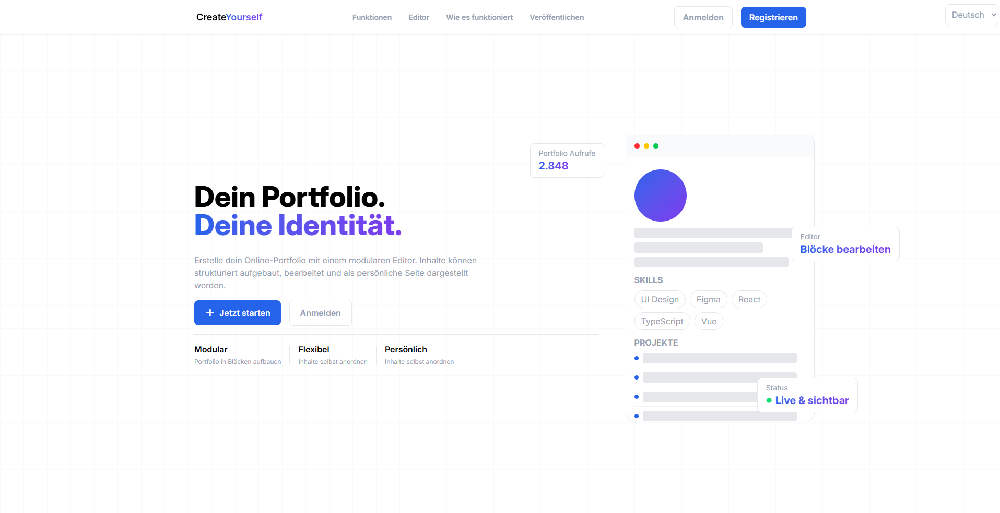
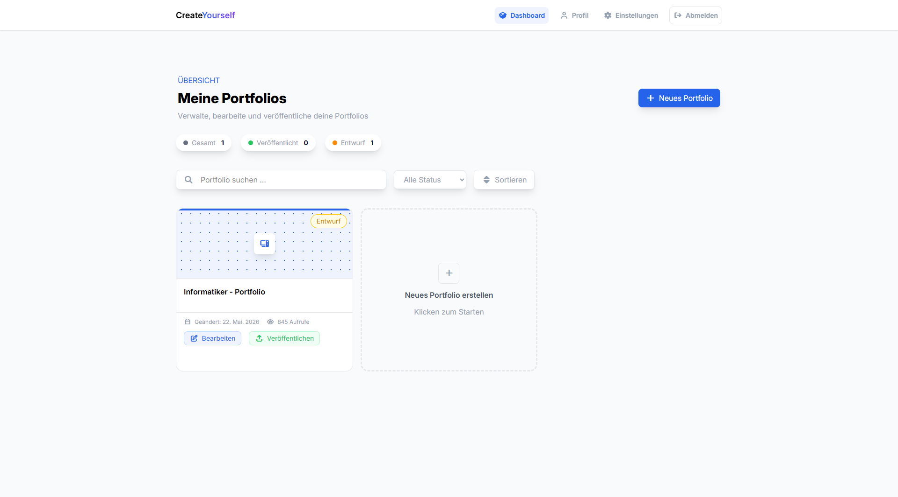

# IPT7.1 – CreateYourself


## Über das Projekt

**CreateYourself** ist eine webbasierte Plattform zur einfachen Erstellung und Veröffentlichung persönlicher Online-Portfolios.

Die Anwendung richtet sich an Lernende, Studierende, Freelancer und Berufseinsteiger, die ihre Projekte, Fähigkeiten und Erfahrungen professionell präsentieren möchten. Mithilfe eines intuitiven Baukasten-Editors können Inhalte ohne Programmierkenntnisse individuell zusammengestellt und gestaltet werden.

Durch verschiedene Layouts, Mehrsprachigkeit und eine dauerhafte öffentliche URL wird das Portfolio zu einer persönlichen digitalen Visitenkarte.

---

## Projektziel

Ziel des Projekts ist die Entwicklung einer modernen Full-Stack-Webanwendung, mit der Benutzer ihr eigenes Portfolio einfach erstellen, verwalten und veröffentlichen können.

Durch einen flexiblen Baukasten-Editor, verschiedene Designmöglichkeiten und eine benutzerfreundliche Oberfläche soll die Erstellung eines professionellen Portfolios auch ohne technische Vorkenntnisse möglich sein.

Die Anwendung legt besonderen Wert auf Benutzerfreundlichkeit, Individualisierung und eine einfache Veröffentlichung der Inhalte.

---

## Funktionen

### Portfolio-Erstellung

* Neues Portfolio erstellen
* Titel und Beschreibung verwalten
* Projekte, Erfahrungen und Fähigkeiten hinzufügen
* Portfolio bearbeiten und aktualisieren

### Baukasten-Editor

* Flexible Inhaltsblöcke
* Drag-and-Drop-Unterstützung
* Reihenfolge der Elemente frei anpassbar
* Verschiedene Blocktypen (Text, Bilder, Projekte etc.)

### Design & Individualisierung

* Auswahl verschiedener Layouts
* Eigene Farben definieren
* Schriftarten auswählen
* Vorschau des Portfolios in Echtzeit

### Veröffentlichung

* Portfolio online veröffentlichen
* Dauerhafte eindeutige URL (Hash-basiert)
* Öffentliches Teilen des Portfolios
* Sichtbarkeit verwalten (öffentlich/privat)

### Benutzerverwaltung

* Registrierung
* Login
* JWT-basierte Authentifizierung
* Benutzerprofil verwalten

### Mehrsprachigkeit

* Benutzeroberfläche in mehreren Sprachen
* Sprache jederzeit wechselbar
* Internationalisierung (i18n)

### Versionierung

* Automatisches Speichern
* Verschiedene Portfolio-Versionen verwalten
* Frühere Versionen wiederherstellen

---

## Dokumentation

Die vollständige Projektdokumentation befindet sich im Ordner `Documentation`.

### Analyse & Planung

- [Technologieentscheid](Documentation/Backend/2_technology.md)
- [Modulübersicht](Documentation/Backend/3_modul-overview.md)
- [Funktionsübersicht](Documentation/Backend/5_function-list.md)
- [Frontend-Seiten](Documentation/Frontend/frontend-sites.md)
- [Page Design](Documentation/Frontend/page-design.md)

### Datenbank

- [Datenbankkonzept](Documentation/Database/concept_db.md)
- [ERM-Diagramm](Documentation/Database/Diagram/ERM_Diagramm.pdf)

### Frontend & UI

- [Mockups](Documentation/Frontend/Mockup/)
- [Farb- und Designkonzept](Documentation/Frontend/color-design.md)
- [Frontend-Seitenstruktur](Documentation/Frontend/frontend-sites.md)
- [Frontend-Testprotokoll](Documentation/Frontend/frontend-testing-protocol.md)

### Backend

- [Backend-Dokumentation](Documentation/Backend/1_backend-documentation.md)
- [API-Endpunkte](Documentation/Backend/4_api-endpoints.md)
- [Datenbankbeziehungen](Documentation/Backend/6_database-relations.md)
- [Security-Konzept](Documentation/Backend/7_security-concept.md)
- [Error Handling](Documentation/Backend/8_error-handling.md)
- [Backend-Struktur](Documentation/Backend/9_backend-structure.md)
- [Backend-Testprotokoll](Documentation/Backend/Testprotokoll_Backend.md)
- [Unix-Testing TODO](Documentation/Backend/UnixTestingTODO.md)
- [Backend-plan](Documentation/Backend/backend-plan.md)

### Docker
- [Docker & Deployment](Documentation/Backend/deployment-documentation.md)
---

## Systemarchitektur

```text
┌──────────────────────────┐
│        Frontend          │
│      Vue 3 + Vite        │
└─────────────┬────────────┘
              │ REST API
              ▼
┌──────────────────────────┐
│         Backend          │
│        JavaScript        │
└─────────────┬────────────┘
              │
              ▼
┌──────────────────────────┐
│         MySQL DB         │
└──────────────────────────┘
```

---

## Verwendete Technologien

### Frontend

* Vue 3
* TypeScript
* Vite
* Pinia
* Vue Router
* Tailwind CSS
* Vue I18n

### Backend

* JavaScript (Node.js)
* JWT Authentication
* REST API

### Datenbank

* MySQL

### Infrastruktur

* Docker
* Docker Compose

---

## Vorschau

### Landingpage



### Dashboard



---

## Verfügbarkeit

Die Anwendung wird über Docker bereitgestellt und kann auf einem eigenen Server betrieben werden.

### Docker

```bash
docker build -t createyourself .
docker run -p 5173:5173 createyourself
```

---

## Entwickler

Projektarbeit im Rahmen des Moduls **IPT 7.1**.

Entwickelt von:

* **Sanjivan** – Teamleiter, Frontend Specialist
* **Gian** – Backend Specialist
* **Egor** – Database Specialist & Frontend Support
* **Kenan** – Dokumentation & Mehrsprachigkeit

---

## Lizenz

Dieses Projekt wurde zu Ausbildungszwecken entwickelt und dient ausschliesslich Lern-, Demonstrations- und Bewertungszwecken.
